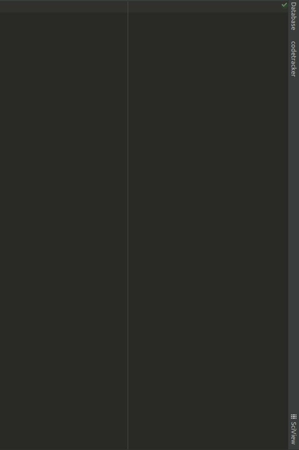

# Codetracker

**Codetracker** is an IntelliJ-based IDE plugin for tracking code changes while solving programming problems.

### Code changes tracking

This plugin writes changes in all open documents in a .csv files and sends them after all to the [codetracker server](https://github.com/nbirillo/coding-assistant-server). 
All data is sent **anonymously**, the only information is file names and the source code. This data can be helpful for 
analyzing students programming patterns or collecting diverse solutions of given problems. For example, 
see [automated hint generation system](https://github.com/JetBrains-Research/codetracker-org.jetbrains.research.ml.codetracker.data), 
based on this data.

### Problems solving

Plugin's ui is designed for choosing different problems to solve and seeing correct examples of 
problem's behaviour. All data about problems is received from the [codetracker server](https://github.com/nbirillo/coding-assistant-server) 
when the plugin starts. 
It is also possible for user to set their age and programming experience. Currently, it's only available on russian language. 

## Installation

**By installing this plugin, you agree to send your source code changes to our server.**

Just clone the repo by `git clone https://github.com/JetBrains-Research/codetracker.git` and run `./gradlew build shadowJar` to build a .zip-file. 
You will find it at the path `build/distributions/codetracker-1.0-SNAPSHOT.zip`. Then add it to the IntelliJ-based IDE you want to use by installing from disk 
(see [this guide](https://www.jetbrains.com/help/idea/managing-plugins.html#install_plugin_from_disk) for example). Also, we created the details [guide](https://github.com/JetBrains-Research/codetracker/wiki) about 
installing and uninstalling the **codetracker**. This guide is available in two languages: English and Russian.

